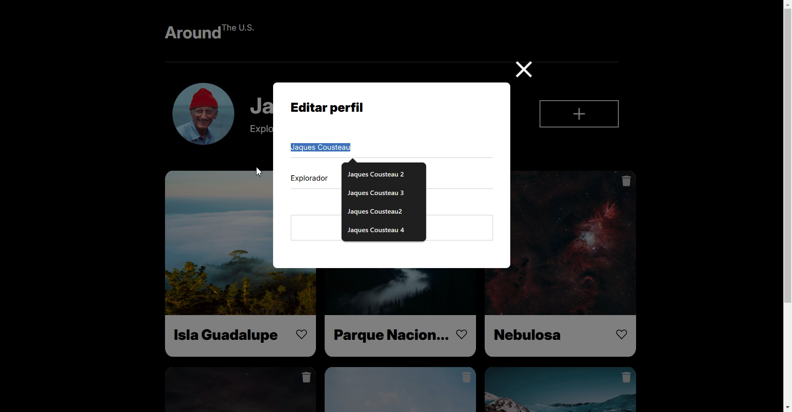
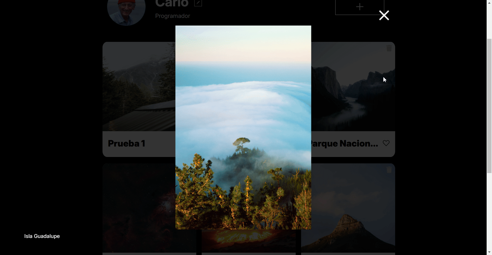

## Enlaces

[Visita el proyecto aquí](https://CarloGutierrezMau.github.io/web_project_around/)

# Tripleten web_project_around

## Una página del diseño de una red social

En esta página se pueden hacer cambios en los nombres del usuario, su descripsion principal y añadir nuevas cartas, incluso interactuar con cada una de las cartas
Es una página que se adapta a cualquier tamaño de pantalla. O deja de crecer en cierto punto o no se amontona el contenido

## Responsive

Al encojerse el tamaño de la página se cambia el grid de 3 columnas a 1
La página se centra a pesar del tamaño de la pantalla a menos que afecte la visibilidad de los elementos

## ¿Que es lo que hace la página?

las funciones vendran con el uso de las tecnologias implementadas de esta manera:

- tecnologia 1:
- tecnologia 2:
- etc, etc.

funcion 1: Editar perfil: En un icono del lapiz encuentras un formulario que te llevara a cambiar el nombre y dedicacion del usuario

funcion 2: Añadir una carta nueva: Das click en el signo de "+" y llenas el formulario como corresponde, esto hara que se añada una carta con nombre e imagen segun tu elección

- Hay toda un constructor de creacion de las imagenes donde se toma el contenido de un template y se clona, tiene clases predefinidas y el contenido es variable
- Al añadir una carta se almacena en un arreglo
- Al arreglo se le itera con un forEach y se crean las cartas segun corresponda al contenido almacenado en el arreglo
- Al añadir una carta se eliminan todas las cartas vaciando el contenedor, esto para volver a crearlas segun lo almacenado en el arreglo de cartas

NOTA sobre los formularios

- Se deshabilitan si no tienen contenido

funcion 3: Dar like a las cards con doble click en cualquier parte de la card o con un click en el corazon de la carta

- Se añadio un event.tarjet al contenedor de cartas y al hacer click en un corazon se confirma que el suceso y se le cambia el src de un corazon blanco a negro, o viseversa

funcion 4: Abrir las imagenes que se muestran en las cartas

- Para esto use event.tarjet para acceder a la imagen especifica con cierta class.
- Se añaden div e img con .createElement, segun sea necesario.
- Al cover negro semitransparente que se ve entre la imagen / texto y todo el contenido original de la página se le añade una addEventListener que elimina lo que se acaba de crear.
- la funcion de eliminar lo creado se le asigno a su vez a la cruz de cerrar.

